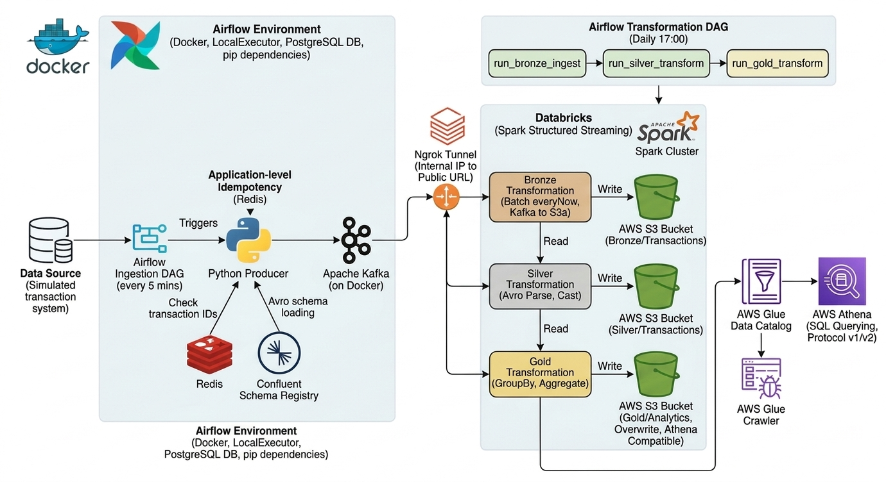

# NexusLake: An End-to-End Medallion Architecture Data Lake with Kafka, Databricks, and Athena

[](architecture_diagram.png)

## Overview

This project implements a comprehensive, robust, and scalable Data Lake architecture on AWS, following the Medallion (Bronze, Silver, Gold) design pattern. It integrates a real-time ingestion pipeline with scheduled, complex transformations, leveraging the power of Databricks-managed Spark in the cloud while maintaining data locality for core components. The solution is fully orchestrated using Apache Airflow.

A key highlight is the hybrid architecture, which securely bridges a local Docker-based Kafka cluster to a cloud-native Databricks environment using an Ngrok tunnel, enabling high-performance Spark Structured Streaming jobs without complex VPN setups.

## Core Features

* **Event-Driven Ingestion:** Apache Kafka handles real-time data input, orchestrated by Apache Airflow.
* **Schema Registry:** Confluent Schema Registry manages Avro schemas for structured and reliable data evolution.
* **Idempotency (Dual-Layer):**
    * *Kafka:* Enables message idempotence to ensure once-only delivery.
    * *Application:* Uses Redis to cache transaction IDs, preventing duplication at the producer level.
* **Medallion Architecture (Bronze, Silver, Gold):** Verifiably structured data storage in AWS S3, enabling phased data refinement.
* **Cloud-Native Spark:** Databricks-managed Spark clusters perform all transformation logic, ensuring elastic scaling and high performance.
* **Ngrok Bridge:** Securely exposes local Kafka to the cloud, enabling frictionless hybrid cloud setups.
* **Serverless BI (Athena):** AWS Glue Crawlers populate a Data Catalog, allowing immediate serverless SQL querying via AWS Athena on Gold refined data.
* **Full Orchestration:** Multiple Airflow DAGs manage the scheduling, dependencies, and execution flow of ingestion and transformations.

## Architecture Flow

*(Please refer to the diagram at the top of this document for a visual flow.)*

1.  **Ingestion (DAG every 5 mins):** Airflow triggers a Python Producer.
2.  **Schema Check & Idempotency:** The producer validates schemas against Schema Registry and checks transaction IDs against Redis.
3.  **Data Write:** Verified, unique data is written to Kafka in Avro format.
4.  **Transformation (DAG Daily):** A transformation DAG with sequential tasks is triggered daily in Databricks.
    * **Bronze:** Reads incremental data from Kafka and writes raw Parquet files to S3a (Bronze location).
    * **Silver:** Reads raw Parquet, parses Avro, applies casting, and writes refined Delta tables to S3a (Silver location).
    * **Gold:** Reads refined Delta, applies business logic, performs aggregations, and overwrites Athena-compatible Delta tables to S3a (Gold location).
5.  **BI Readiness:** Gold data is crawled by AWS Glue, creating a metastore used by AWS Athena for SQL queries.

## Technologies Used

* **Infrastructure:** AWS S3 (Bucket), Docker Compose, Ngrok.
* **Streaming:** Apache Kafka, Confluent Schema Registry (Avro).
* **Caching:** Redis.
* **Computing:** Databricks Spark (Cloud-Managed), Pyspark (Python).
* **Orchestration:** Apache Airflow.
* **Catalog & Query:** AWS Glue Crawler, AWS Glue Data Catalog, AWS Athena.

## Getting Started

### Prerequisites

* Docker and Docker Compose.
* An AWS Account with S3 permissions (Access Key and Secret Key).
* A Databricks workspace.
* An Ngrok Account and AuthToken.

### Steps to Run

1.  **Configure AWS Credentials:** Please update `src > utils > helpers.py` file for your AWS Access Key, Secret Key, and Bucket name.
2.  **Start Local Infrastructure:**
    ```bash
    docker-compose up -d --build
    ```
    This command starts Kafka, Schema Registry, Redis, PostgreSQL, and Airflow.
3.  **Setup Ngrok Tunnel:** In a separate terminal or within Docker, expose your local Kafka listener (e.g., port 9094) publicly.
    ```bash
    ngrok tcp 9094
    ```
    *Update your Databricks scripts and Airflow configuration with the public TCP address provided by Ngrok.*
4.  **Access Airflow UI:** Open `http://localhost:8080`. Activate the DAGs:
    * `nexuslake_ingestion_v1`: For 5-minute ingestion.
    * `nexuslake_transformation_v1`: For daily transformations on Databricks.
5.  **Verify BI Path (AWS Console):** Run the Glue Crawler to generate the schema from your Gold data in S3. Use Athena to query the results.

## Contributing

Contributions are welcome. Please submit a Pull Request.